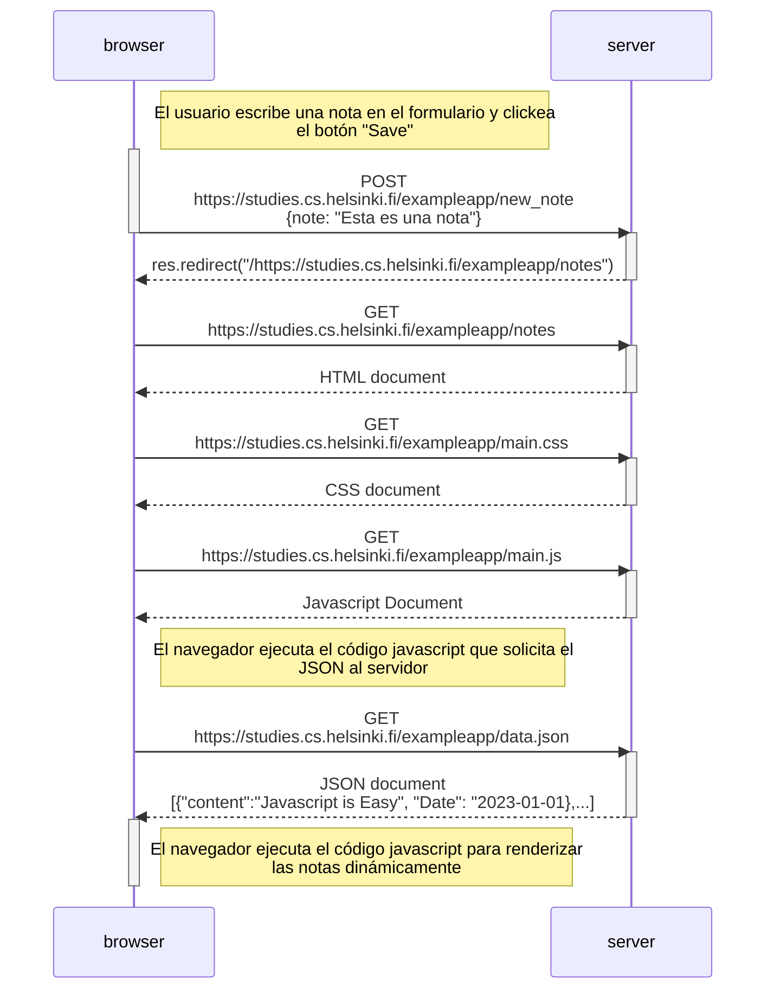

```mermaid
sequenceDiagram
    participant browser
    participant server

    Note right of browser: El usuario escribe una nota en el formulario y clickea <br> el botón "Save"

    activate browser
    browser ->> server: POST <br> https://studies.cs.helsinki.fi/exampleapp/new_note <br>{note: "Esta es una nota"}
    deactivate browser

    activate server
    server -->> browser: res.redirect("/https://studies.cs.helsinki.fi/exampleapp/notes")
    deactivate server

    browser ->> server: GET<br> https://studies.cs.helsinki.fi/exampleapp/notes
    activate server
    server -->> browser: HTML document
    deactivate server

    browser->>server: GET <br> https://studies.cs.helsinki.fi/exampleapp/main.css
    activate server
    server-->>browser: CSS document
    deactivate server

    browser->>server: GET <br> https://studies.cs.helsinki.fi/exampleapp/main.js
    activate server
    server-->>browser: Javascript Document
    deactivate server

    Note right of browser: El navegador ejecuta el código javascript que solicita el <br> JSON al servidor

    browser->>server: GET <br> https://studies.cs.helsinki.fi/exampleapp/data.json
    activate server
    server-->>browser: JSON document <br> [{"content":"Javascript is Easy", "Date": "2023-01-01},...]
    deactivate server

    activate browser
    Note right of browser: El navegador ejecuta el código javascript para renderizar <br>las notas dinámicamente 
    deactivate browser

```