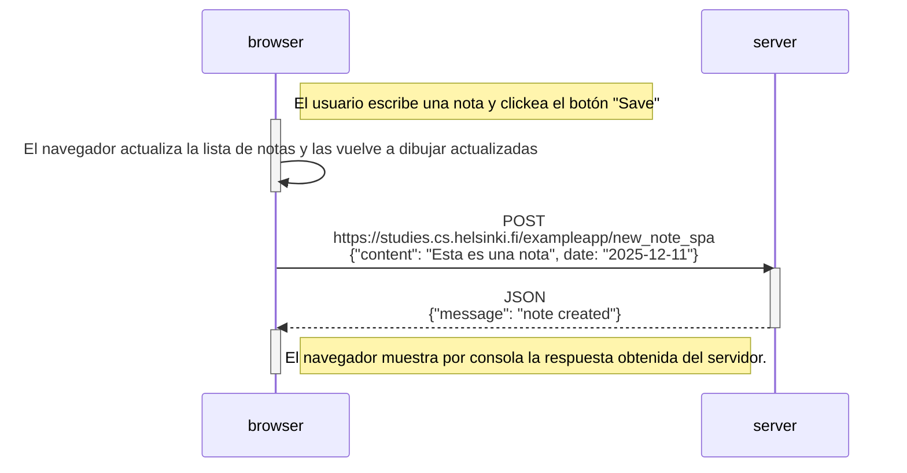

# Nueva nota en diagrama de aplicación SPA

```mermaid
sequenceDiagram
    participant browser
    participant server
    Note right of browser: El usuario escribe una nota y clickea el botón "Save"


    activate browser
    browser->>browser: El navegador actualiza la lista de notas y las vuelve a dibujar actualizadas
    deactivate browser

    browser->>server: POST <br>  https://studies.cs.helsinki.fi/exampleapp/new_note_spa <br> {"content": "Esta es una nota", date: "2025-12-11"}
    activate server
    server-->>browser: JSON <br> {"message": "note created"}
    deactivate server

    activate browser
    Note right of browser: El navegador muestra por consola la respuesta obtenida del servidor.
    deactivate browser

```